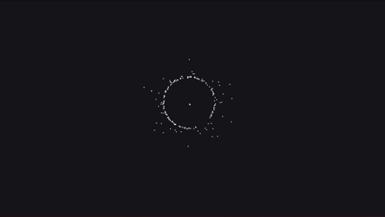
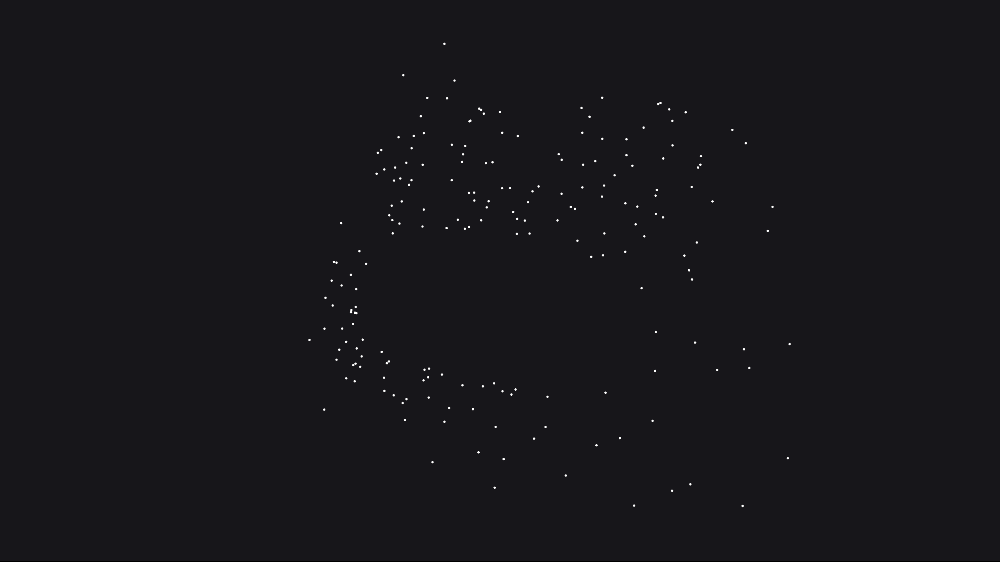

[EN](./README.md)

# Симуляція інтерактивної системи частинок

### [Live Demo](https://semivate.github.io/particle_system_simulation/)

Інтерактивна симуляція автономної системи частинок, побудована на базі графічного рушія Pixi.js. Проєкт реалізує фізичну модель поведінки частинок. Створено як навчально-практичний експеримент для дослідження математичних моделей у веб-графіці.

---

## Функції

- **Адаптивний рендеринг:** Автоматичне масштабування під розміри вікна браузера, увімкнене згладжування забезпечує високу якість субпіксельного відтворення частинок.
- **Синхронізований ігровий цикл:** Обчислення фізичних параметрів і оновлення графіки повністю синхронізовані з частотою оновлення екрана користувача. На кожному кадрі система централізовано зчитує поточні розміри робочої зони та координати курсора, після чого передає ці дані об'єктам для ізольованого перерахунку їхнього руху.
- **Глобальний трекінг миші:** Система відстежує стан курсора. Коли мишка залишає межі вікна, частинки автоматично переводяться в режим затухання.

## Фізика та архітектура

- У конструкторі задаються унікальні фізичні параметри для кожної частинки за допомогою лінійної інтерполяції випадкових чисел, де початкова швидкість обчислюється як:
  $$
  \Delta v = (\text{Math.random()} - 0.5) \cdot 4
  $$
- При натисканні на екран генерується імпульс, що відштовхує частинки від епіцентру. Напрямок задається як одиничний вектор $\vec{u} = \left( \frac{\Delta x}{d}, \frac{\Delta y}{d} \right)$ через відстань $d = \sqrt{\Delta x^2 + \Delta y^2}$, а нова швидкість дорівнює:
  $$
  \vec{v}_{\text{new}} = \vec{v}_{\text{old}} + \vec{u} \cdot 45
  $$
- Коли мишка активна, зона взаємодії циклічно змінюється залежно від часу. Через пилкоподібну функцію часу $\text{progress} = (\text{Date.now()} \cdot 0.001) \pmod 1$ динамічний радіус пульсує за формулою:
  $$
  R_{\text{dynamic}} = 180 - \text{progress} \cdot 100
  $$
- Частинки намагаються зайняти позиції на колі навколо миші за концепцією Steering Behaviors. Ціль обчислюється як $x_{\text{target}} = x_{\text{mouse}} + \cos(\theta) \cdot R_{\text{dynamic}}$, а сила керування обмежується параметром $F_{\text{max}}$:
  $$
  \vec{F}_{\text{steer}} = \frac{\vec{v}_{\text{desired}} - \vec{v}_{\text{current}}}{|\vec{v}_{\text{desired}} - \vec{v}_{\text{current}}|} \cdot F_{\text{max}}
  $$
- При ударі об край екрана вектор швидкості по відповідній осі інвертується і множиться на коефіцієнт пружності $k_{\text{bounce}} = 0.8$, імітуючи втрату 20% кінетичної енергії:
  $$
  v_{\text{new}} = -v_{\text{old}} \cdot 0.8
  $$

---

## Використані технології

- **TypeScript**
- **Vite**
- **Pixi.js (v8)**
- **@pixi/devtools**
- **HTML5 Canvas**

---

## Попередній перегляд

